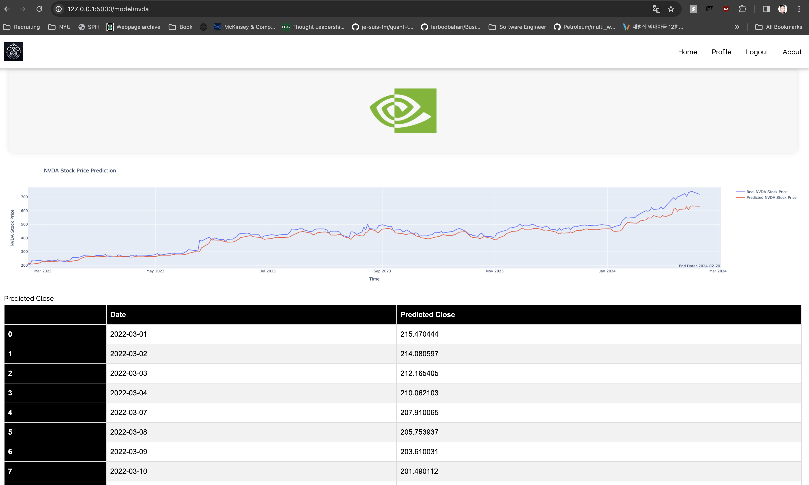

# Equity.AI: Empowering Retail Investors with Data and Insights

## Overview

Equity.AI is an innovative platform designed to empower retail investors with predictive insights and data analytics through advanced machine learning models, including Recurrent Neural Networks (RNN) and Long Short-Term Memory (LSTM) networks. By processing historical stock data, Equity.AI reveals patterns and forecasts future market movements, giving users a strategic advantage in their investment decisions.

## Key Features

- **Predictive Stock Analytics:** Harness the power of LSTM models for precise stock market forecasts.
- **Investor Portfolio Insights:** Access real-time portfolios and investment strategies of top-performing investors.
- **Interactive Data Visualization:** Engage with dynamic charts and graphs for an in-depth financial analysis.
- **Strategic Investment Recommendations:** Benefit from AI-driven investment strategies tailored to your financial goals.

## Technology Stack


## Getting Started

### Prerequisites

- Python 3.8 or higher
- MongoDB
- Flask

### Installation

```bash
git clone https://github.com/yourusername/equity.ai.git
cd equity.ai
pip install -r requirements.txt
```

For Conda Users:
If you are using Conda, you can create an environment using the environment.yml file:

```bash
conda env create -f environment.yml
conda activate ModelPyEnv

``` 
### Usage

1. Start the Flask application: `python app.py`.
2. Access the web interface on `localhost:5000`.

## Deep Dive into LSTM and Stock Prediction

LSTMs are a type of RNN capable of learning order dependence in sequence prediction problems. Unlike traditional RNNs, LSTMs can remember information for long periods, making them ideal for analyzing stock prices, which are sequential data prone to long-term dependencies and volatility.

### Why LSTMs for Stock Prediction?

- **Memory Advantage:** LSTMs remember key patterns over long periods, essential for capturing the financial market's temporal dynamics.
- **Mitigating Gradient Vanishing:** LSTMs overcome the vanishing gradient problem, enabling more effective learning of complex patterns.
- **Adaptability:** Capable of adapting to new trends without forgetting previous learning, crucial in the ever-evolving stock market.

## Application's Goal

Equity.Ai is designed to democratize access to sophisticated financial analytics, providing retail investors with tools previously available only to professionals. By integrating cutting-edge AI models, ModelPy levels the playing field, allowing users to make informed investment decisions based on robust data analysis.


## Home Interface 
Upon launching the web application, users are greeted with the home screen, which displays the top 5 stocks and their predictions. This screen is designed to provide quick insights and easy navigation to detailed analyses.


## Prediction Interface 

The prediction section of the application showcases the output of LSTM models for selected stocks. Users can view detailed forecasts, historical trends, and make informed decisions based on the AI-driven predictions.


## Portfolio Interface
Real-time insights into the strategies of top investors and institutional banks.


## Contributing

We welcome contributions! If you have suggestions for improvements, please fork the repo and submit a pull request.

## License

This project is licensed under the MIT License - see the LICENSE file for details.
