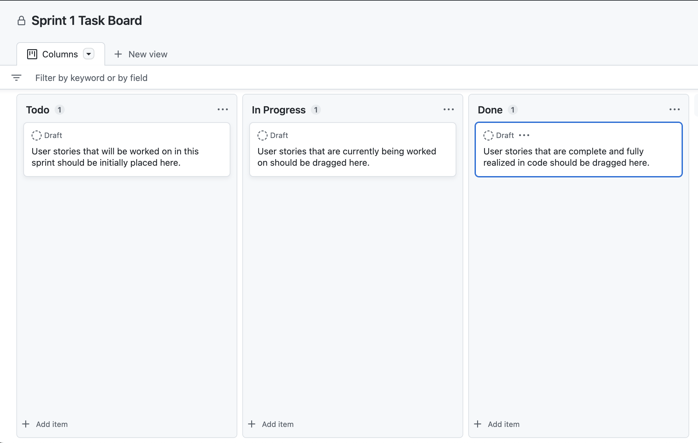

# Web Application Exercise

A little exercise to build a web application following an agile process.

## Technology stack

We will use a Python-centric web application technology stack, consisting of:

- HTML & CSS for the front-end
- A Python back-end using [flask](https://flask.palletsprojects.com/en/2.2.x/)
- A MongoDB database connected to the Python back-end using [pymongo](https://pymongo.readthedocs.io/en/stable/)

Credentials for connecting to the database must be stored in a [.env](https://knowledge.kitchen/content/courses/software-engineering/slides/flask-pymongo/#combined) file and not included in version control and shared among teammates (and admins/managers) using the team's messenger system.

## Design

The design of this web application must be suitable for use on a mobile phone. The design need not be responsive and the design need not look great on a tablet or desktop/laptop computer.

You are not required to produce wireframes, design mockups, or a clickable prototype for this application. However, you are encouraged to do so if you wish.

The application must consist of at least 6 different screens.

- at least 2 of these must display data retrieved from the database.
- at least 1 of these must allow the user to add data to the database.
- at least 1 of these must allow the user to edit data in the database.
- at least 1 of these must allow the user to delete data from the database.
- at least 1 of these must allow the user to search for data in the database.

## Agile development

Teams must work following an "agile" methodology. While there are exist variety of ways teams often implement so-called agile development, in our case, this means specifically the following:

### Discord channel

Teams must create a public channel in the course Discord server to use for team communication

- teams are expected to self-organize and create and join the channel themselves
- name the Discord channel after your team, e.g. `team-7`.

### Product vision statement

Teams must write a product vision statement for their web application and place it in the `README.md` file. This should be one-sentence description of the project.

### User stories

To begin, teams must develop a set of user stories that define the product they are building.

- user stories should be written in the form "As a `[user type]`, I want `[some goal]` so that `[some reason]`."
- user stories should be created as Issues in the team's GitHub repository.

A link to the Issues page should be included in the `README.md` file.

### Incremental work

The project will consist of two sprints, i.e. increments of work, each of which will last for one week.

- towards the end of the first sprint (but no later than 2 after the completion of the first sprint), teams must have scheduled a meeting with a stakeholder (i.e. professor, tutor, or grader) to demo and solicit feedback on the work done so far.
- at the end of the second sprint, teams should be prepared to demo the project to a wider audience if requested.

### Task boards

- for each sprint, teams must maintain a "task board" where they track the progress of their user stories - see example screenshot below.
- task boards should be created as Projects in the team's GitHub repository - one for each sprint.
- prefix the name of each project with the team name or number, followed by the sprint number, e.g. "`Team 7 - Sprint 1`", "`Team 7 - Sprint 2`", etc.

A link to the Projects page should be included in the `README.md` file.

### Daily standups

Teams must hold 3 or more "daily" standup meetings per week.

- these meetings must last no longer than 10 minutes
- during these meetings, each team member must answer three questions:
  - what have I done since last meeting?
  - what am I working on now?
  - what problems are blocking me for continuing?
- at the conclusino of each daily standup, one team member must create a single post in the team's Discord channel that documents each member's answers to each of these questions.
- any blocking problems must be immediately addressed by the team; if the team cannot solve it internally, it must be brought to the attention of the manager (i.e. the professor).

### GitHub repository

Team members are required to work from a single GitHub shared repository.

- each team member must be able to push and bull to and from the shared repository.
- each member's code contributions will be tracked, so team members must use their own accounts when making code changes.
- code changes must be done in branches in the same repository, not in the `main` branch and not in forked repositories.
- when a code change is complete, the branch should be pushed to GitHub and a pull request should be created using GitHub's interface. Another team member must approve the pull request and merge it into the `main` branch if it is good code.

### Submitting

The project must be submitted by pushing to the GitHub repository. The `main` branch will be considered the final code. Any `.env` files must be submitted to admins/managers via the team's messenger channel.

Teams do not need to deploy the application to a server. It must simply work when run locally.
